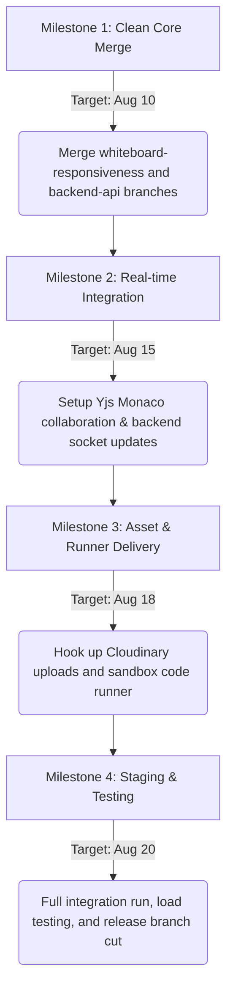

# Week 1 & 2 Post-Review Planning Session & Sprint 2 Roadmap

**Project**: SyncSpace  
**Date**: August 6, 2026  
**Facilitator**: Aditya (Team Leader)  
**Attendees**: Aditya, Akshay, Chandramahesh, Alex Dev, Jordan Dev  

---

## 1. Week 1 & 2 Review & Feedback Analysis

During the post-review session, the team analyzed codebase changes, developer feedback, and early user reviews to identify key areas of success and friction.

### What Went Well
*   **High-Fidelity Code Editor**: Integrated Monaco Editor with syntax highlighting, default tabs, and smooth layout rendering.
*   **Real-time Collaboration**: Established working Socket.io connections for synchronous canvas drawing strokes and workspace room events.
*   **Premium Visual Design**: Applied consistent CSS variables, custom dark themes, glassmorphic UI, and custom scrollbars across the landing page, lobby, and dashboard.

### Areas for Improvement (Review Action Items)
*   *Responsiveness*: The dashboard, login screens, and editor workspace suffered from layout clipping on smaller tablets and mobile screens.
*   *Safety & Validation*: Backend Room APIs lacked request schema validations, making database queries susceptible to malformed inputs.
*   *Asset upload controls*: The File Vault dropzone was purely visual and did not allow actual click-to-upload file selection or state propagation.
*   *Configuration*: Hardcoded API endpoints were identified in the client; environment variables must be dynamically managed.

---

## 2. Project Progress Review

The current status of SyncSpace modules is categorized as follows:

| Module / Component | Status | Target Branch | Notes |
| :--- | :--- | :--- | :--- |
| **Monaco Editor Integration** | Completed | `development` | Integrated via `@monaco-editor/react`. |
| **Real-time Draw & Sync** | Completed | `development` | Core drawing with Socket.io functional. |
| **UI Aesthetics & Themes** | Completed | `development` | Custom dark-theme scrollbars & glassmorphic layout. |
| **Whiteboard Responsiveness & Touch** | Ready for Merge | `feature/whiteboard-responsiveness` | Adds ResizeObserver, touch handlers, and File Vault input select. |
| **Room API Validation & Sockets** | Ready for Merge | `feature/backend-api` | Enhances validation middleware, schemas, and error boundaries. |
| **Code Runner & Sandboxed Execution** | In Progress | `feature/code-runner` | Configuring code execution container/endpoint. |
| **File Vault Cloud Uploads** | In Progress | `feature/file-vault` | Integrating Cloudinary/S3 storage service. |
| **Yjs Conflict-free Monaco Sync** | Pending | `feature/monaco-yjs` | Character-level collaboration setup. |

---

## 3. Coordinated GitHub Commit Workflow

To maintain repository cleanliness and coordinate daily commits, the following strict workflow has been established:

1.  **Branch Synchronization**: Always fetch and pull the latest changes from `development` before starting new tasks.
    ```bash
    git checkout development
    git pull origin development
    ```
2.  **Isolated Feature Branches**: Create descriptive feature branches from `development`.
    *   *Naming format*: `feature/<module-name>-<subtask>` (e.g., `feature/file-vault-cloudinary`, `feature/code-runner-sandbox`).
3.  **Clean Micro-Commits**: Ensure commits are atomic and follow [Conventional Commits](https://www.conventionalcommits.org/):
    *   `feat(...)`: for new features.
    *   `fix(...)`: for bugs or hotfixes.
    *   `style(...)`: for formatting, missing semi-colons, and pure CSS updates.
    *   `refactor(...)`: for code restructuring without behavior changes.
4.  **Pull Request Protocol**:
    *   Push local branches to GitHub and create a Pull Request targeting `development`.
    *   A minimum of **1 peer review** is required for merges.
    *   Continuous Integration (CI) checks must pass.
5.  **Daily Commit & Sync Cadence**:
    *   Teammates are expected to push code at least once per day to their active remote branch.
    *   Daily standups at **10:00 AM** to review blockers, PRs, and merge conflicts.

---

## 4. Next Sprint (Sprint 2) Task Assignments

Sprint 2 runs from **August 7 to August 20, 2026**. Tasks have been allocated based on domain expertise:

### 👤 Aditya (Team Leader & Architect)
*   [ ] Coordinate pull request reviews and resolve merge conflicts in `development`.
*   [ ] Deploy development and staging environments on Vercel (Frontend) and Render (Backend).
*   [ ] Write integration test suites checking Room Join and Canvas sync events.
*   [ ] Establish post-sprint review criteria.

### 👤 Akshay (Frontend Specialist)
*   [ ] Test and merge `feature/whiteboard-responsiveness` into `development`.
*   [ ] Refactor drawing canvas toolbars for small mobile screens (hide non-essential icons dynamically).
*   [ ] Implement interactive file cards list in the sidebar displaying actual upload statistics.
*   [ ] Design the user presence list tooltips.

### 👤 Chandramahesh (Backend Specialist)
*   [ ] Test and merge `feature/backend-api` validation improvements into `development`.
*   [ ] Update controller handlers to persist whiteboard strokes as database snapshots in MongoDB periodically.
*   [ ] Establish express rate-limiters on `/api/room` and `/api/auth` endpoints.
*   [ ] Add comprehensive Swagger API documentation.

### 👤 Alex Dev (Full-Stack & DevOps)
*   [ ] Design upload controller in the backend utilizing Cloudinary / AWS S3 storage configurations.
*   [ ] Connect client File Vault drag-and-drop actions to backend uploading APIs.
*   [ ] Add file-type checking constraints (block execution files like `.exe`, `.bat` for safety).
*   [ ] Configure automatic GitHub Actions workflows for continuous build testing.

### 👤 Jordan Dev (Database & Editor Specialist)
*   [ ] Implement character-level collaborative synchronization in the Monaco Editor using Yjs.
*   [ ] Establish the backend code-execution router to invoke sandboxed compilation runs.
*   [ ] Add language selector triggers in Monaco supporting JS, Python, and C++ runtimes.
*   [ ] Sync editor cursor placements across session peers.

---

## 5. Integration Roadmap & Milestones

To guarantee a clean build and timely deployment, integration will follow three consecutive checkpoints:



### Milestone Details
1.  **Checkpoint 1 (Aug 10)**: Core UI polish and schema safety. Validate that room creation and join forms reject invalid payloads. Ensure mobile devices have full touch drawing support.
2.  **Checkpoint 2 (Aug 15)**: Multi-cursor synchronization. Character additions/deletions must propagate without conflicting with canvas state updates on the socket line broker.
3.  **Checkpoint 3 (Aug 18)**: File Vault asset transfers and code execution. Test runtime security configurations to ensure sandboxed runner limits network and file access on the host container.
4.  **Checkpoint 4 (Aug 20)**: Final QA regression tests. Cut release branch `release/v1.0.0` from `development` and merge to `main`.
